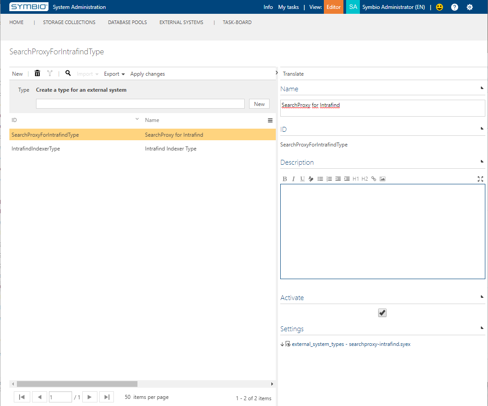
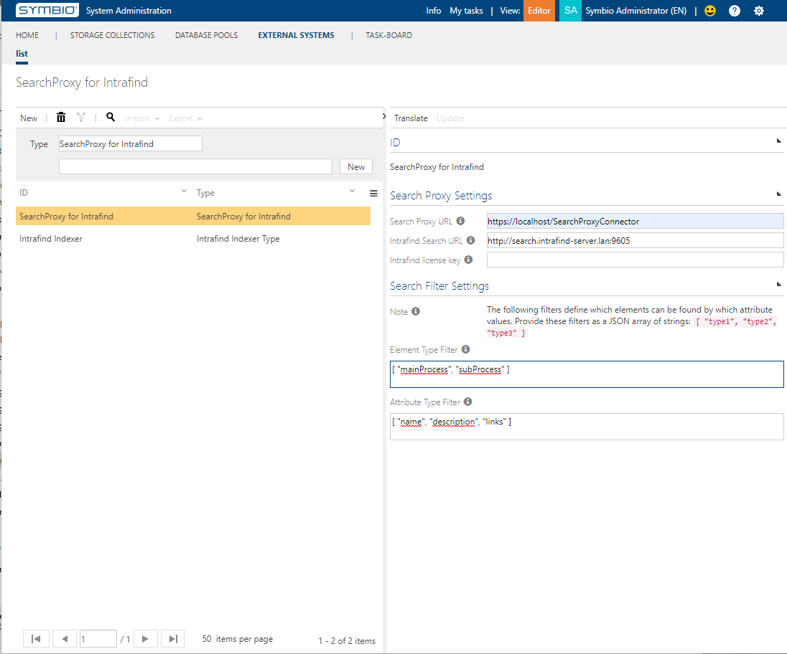

# Configuration

## Requirements

Symbio-Version: 1812 or higher

## Configuring Symbio

The following steps describe how to set up the usage of the SearchProxy for Intrafind in Symbio.

### Setting up a new External System

1. In Symbio, enter the admin page of the System Administration and select Configure > Extended configuration.
1. Create a type for an external system, e.g. "SearchProxyForIntrafindType":
   - Name the new type appropriately;
   - Add the settings file "external_system_types - searchproxy_intrafind.syex" from Symbio's Data tab in the "Package" dialog;
   - Activate the new type
   - Press "Apply changes".
   
1. In Symbio enter the External Systems facet of the System Administration and create a new external system:
   - Choose your new type from the drop down and enter an appropriate ID, e.g. "Default Intrafind SearchProxy"
   - Set the Search Proxy URL to the chosen IIS binding of your IFSP installation
   - Set the Intrafind URL and license key to the ones provided by your Intrafind manager/administrator
   - Set the Element Type Filter to the API names of the elements which should be found in the fallback search if the IFSP is not available, e.g. "[ "mainProcess", "subProcess" ]"
   - Set the Attribute Type Filter to the API names of the attributes which should be searched in the fallback search if the IFSP is not available, e.g. "[ "name", "description", "links" ]"
   
1. Add the new external system to all databases that should use Intrafind for its Viewer search

### Conclusion

The connected databases will from now on use Intrafind for its Viewer search. To be able to find something you will need to also set up the Intrafind Indexer and connect it to those databases.
